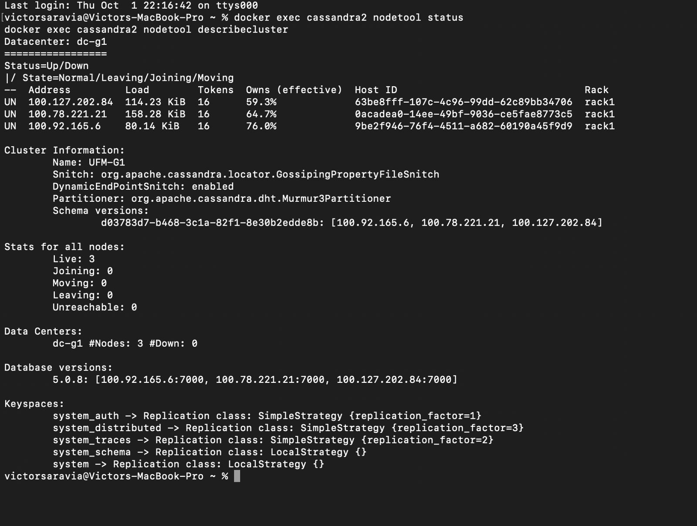
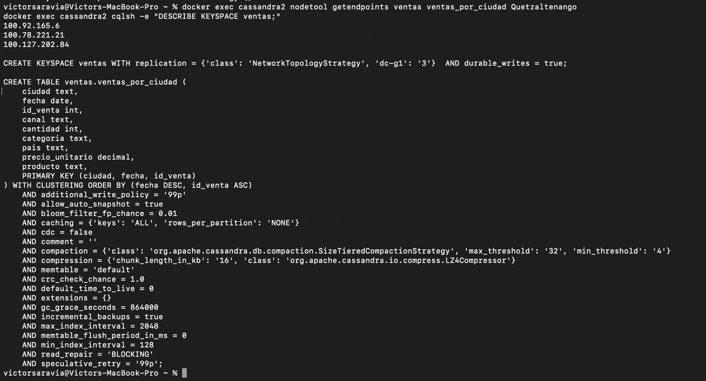
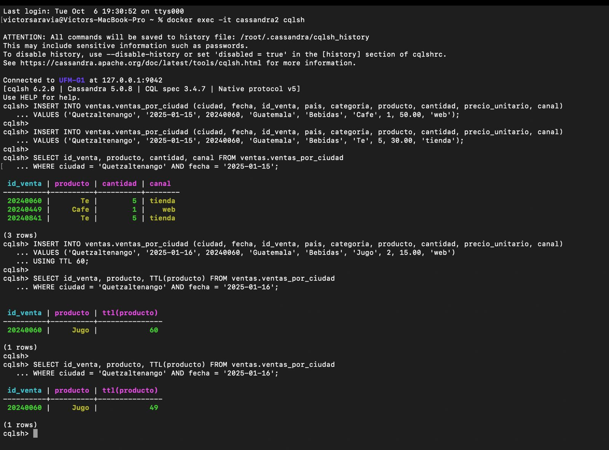
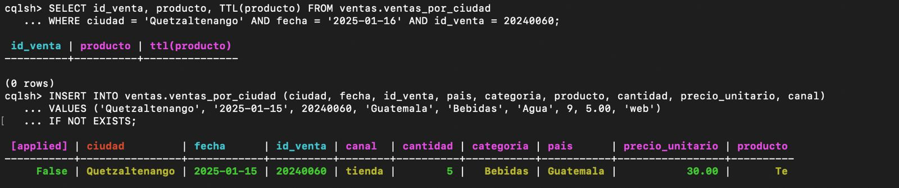
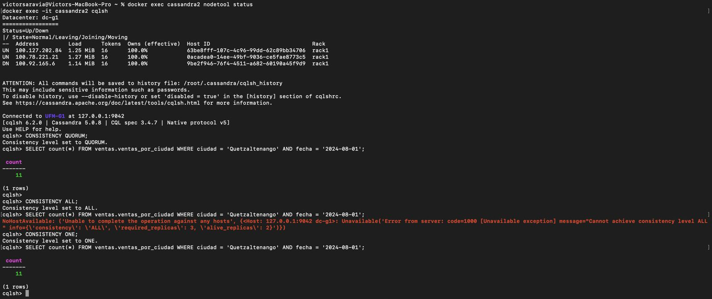
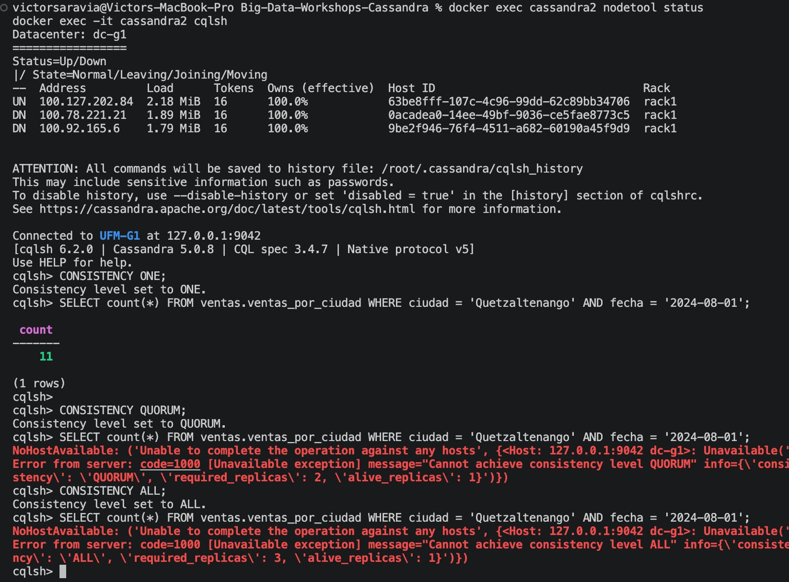
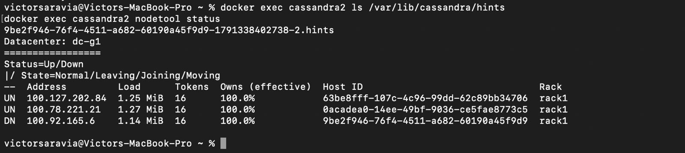
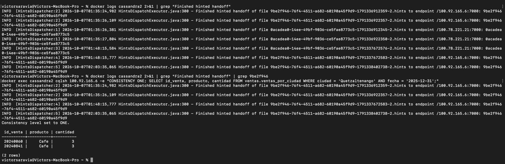

# Bitácora del taller de Cassandra

- **Nombre:** Victor Saravia
- **Carné:** 20240060
- **Grupo:** G1
- **Tu nodo en el clúster del grupo:** cassandra2

---

## 1. Evidencias

### E1. Tres nodos en tu clúster y tu datacenter

`nodetool status` muestra los tres nodos `UN` en `dc-g1`; `nodetool describecluster` confirma `UFM-G1` y tres nodos vivos.

### E2. Las copias de la partición de Quetzaltenango

La partición de Quetzaltenango tiene los endpoints `100.92.165.6`, `100.78.221.21` y `100.127.202.84`; el keyspace `ventas` usa tres copias en `dc-g1`.

### E3. Upsert, TTL e IF NOT EXISTS

Los dos `INSERT` usan el mismo carné y la lectura muestra una fila `20240060` con los valores del segundo; también se ve el TTL bajar de 60 a 49 segundos. La consulta lista tres carnés porque la partición contiene filas de mis compañeros.

Después de expirar, la consulta devuelve `(0 rows)`; `IF NOT EXISTS` devuelve `[applied] False` y conserva la fila existente.

### E4. Un nodo caído: QUORUM frente a ALL

`100.92.165.6` aparece `DN`; la lectura con `QUORUM` devuelve 11 y la misma lectura con `ALL` se rechaza porque solo hay dos réplicas vivas.

### E5. Dos nodos caídos: ONE frente a QUORUM

Con `100.78.221.21` y `100.92.165.6` en `DN`, `ONE` devuelve 11; `QUORUM` y `ALL` se rechazan porque queda una sola réplica viva.

### E6a. El hint guardado para el nodo caído

El archivo `.hints` empieza con el Host ID `9be2f946-76f4-4511-a682-60190a45f9d9`, que coincide con la fila `DN` de `100.92.165.6`.

### E6b. La entrega del hint

El log confirma la entrega del hint a `100.92.165.6:7000`; al consultar ese nodo aparece mi venta `20240060`, con producto `Cafe` y cantidad 3.

### Tabla del Paso 8

| Nodos caídos | `ONE` | `QUORUM` | `ALL` |
|---|---|---|---|
| 0 | ✅ | ✅ | ✅ |
| 1 | ✅ | ✅ | ❌ |
| 2 | ✅ | ❌ | ❌ |

---

## 2. Preguntas

**1. ¿Qué línea de la traza muestra que la consulta por ciudad leyó una sola partición, y cuál que la de producto recorrió toda la tabla? ¿Por qué Cassandra rechaza la segunda sin ALLOW FILTERING?**

En mi traza, la consulta por ciudad muestra `Executing single-partition query on ventas_por_ciudad` a las 20:20:30.203001 y luego `Read 11 live rows`.
La consulta por producto muestra `Submitting range requests on 17 ranges` y `Executing seq scan across 1 sstables`; encontró 4,911 filas de Miel.
La partición se encuentra directamente con `ciudad`, que es la partition key. `producto` no es una llave, así que sin `ALLOW FILTERING` Cassandra no puede ubicar una sola partición y rechaza la consulta.

**2. ¿Qué lecturas se comportaron como CP y cuáles como AP? ¿Qué nivel usarías para el saldo de una cuenta y cuál para un contador de reproducciones, y por qué?**

Con cero nodos caídos respondieron `ONE`, `QUORUM` y `ALL`; con uno, `ALL` falló y los otros dos respondieron.
Con dos nodos caídos respondió `ONE`, mientras `QUORUM` y `ALL` fallaron. `ONE` se comportó como AP: responde con una réplica disponible, aunque podría estar atrasada.
`QUORUM` y `ALL` se comportaron como CP al fallar cuando no reunieron las réplicas requeridas. Para el saldo usaría `QUORUM` también al escribir; para reproducciones usaría `ONE` si priorizo disponibilidad sobre un conteo actualizado al instante.

**3. ¿Cómo se enteró el nodo apagado de tu venta? ¿Qué pasaría si el nodo estuviera apagado más tiempo que max_hint_window?**

Mientras `cassandra3` estaba apagado, `cassandra2` guardó un hint para el Host ID `9be2f946-76f4-4511-a682-60190a45f9d9`.
El log real (UTC 2026-10-07T01:35:24,982) dice: `Finished hinted handoff of file 9be2f946-76f4-4511-a682-60190a45f9d9-1791336912359-2.hints to endpoint /100.92.165.6:7000: 9be2f946-76f4-4511-a682-60190a45f9d9`.
Al volver el nodo, el coordinador le entregó el hint y Cassandra pudo aplicar la escritura pendiente. Si supera `max_hint_window`, el hint expira; habría que recuperar la réplica con reparación o sincronización de datos.

---

## 3. Mini-reto

### Tablas

| Tabla | Consulta que responde | Partition key | Clustering key |
|---|---|---|---|
| `perfil_usuario` | C1 | `usuario_id` | — |
| `reproducciones_recientes_por_usuario` | C2 | `usuario_id` | `reproducida_en DESC`, `reproduccion_id ASC` |
| `canciones_por_playlist_orden` | C3 | `playlist_id` | `posicion ASC`, `cancion_id ASC` |
| `reproducciones_por_cancion_dia` | C4 | (`cancion_id`, `dia`) | `reproduccion_id` |

### Justificación

**Por qué esas llaves:**

En C1 busco por `usuario_id`, así que esa llave trae el perfil desde una partición. En C2 particiono por usuario y ordeno por fecha descendente para devolver sus diez reproducciones recientes. En C3 la playlist identifica la partición y la posición deja sus canciones ordenadas. Para C4 uso la canción y el día como partition key compuesta, porque ambos parámetros fijan una sola partición para contar las reproducciones de ese día.

**Qué datos quedaron duplicados entre tablas:**

El título y el artista de cada canción están duplicados en `reproducciones_recientes_por_usuario` y `canciones_por_playlist_orden`. Los copié para responder C2 y C3 sin hacer JOIN. El perfil de usuario queda en `perfil_usuario`; la tabla C4 guarda el identificador de cada reproducción dentro de su canción y día.

**Qué hace la aplicación si cambia un dato duplicado:**

Si cambia el título o el artista, la aplicación debe actualizar las filas de esa canción en las dos tablas que duplican esos datos. Como Cassandra no tiene JOIN ni actualiza esas copias automáticamente, la aplicación mantiene la consistencia entre ellas y debe reintentar las escrituras fallidas.

---

## 4. Problemas encontrados

Durante la carga, `cqlsh COPY FROM STDIN` requería terminar la entrada con un punto en una línea sola; corregí el terminador y las cuatro tablas se cargaron sin filas omitidas.
